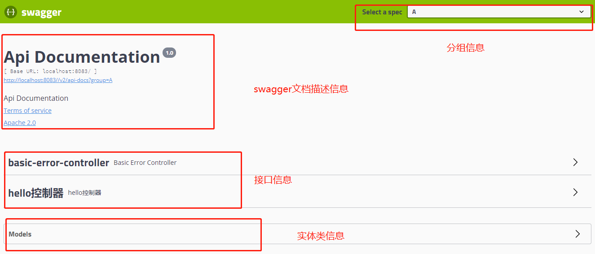

## Swagger简介  
### 前后端分离
- vue+SpringBoot

后端时代:前端只用管理静态页面，HTML，后端 JSP=>后端是主力  
前后端分离时代:    

- 后端:后端控制层,服务层,数据访问层【后端团队】
- 前端:前端控制层，视图层【前端团队】  
伪造后端数据，json，已经存在了，不需要后端，前端工程依旧能够跑起来
- 前后端如何交互? ===>API
- 前后端相对独立，松耦合
- 前后端甚至可以部署在不同的服务器上


#### 产生一个问题:
- 前后端集成联调，前端人员和后端人员无法做到"即时协商,尽早解决",最终导致问题爆发  
#### 解决方案:
- 首先指定schema[计划的提纲],实时更新最新的API，降低集成的风险;
- 早些年，制定Word计划文档;
- 前后端分离:  
    前端测试后端接口:postman  
    后端提供接口，需要实时更新最新的消息及改动！  

### Swagger  
- 号称世界上最流行的Api框架  
- Restful Api文档在线自动生成工具=》Api文档与Api定义同步更新  
- 直接运行，可以在线测试Api接口
- 支持多种语言  
官网: [https://swagger.io/]()  

#### 在项目中使用swagger需要Springbox
- swagger2
- ui  

### SpringBoot集成Swagger  
1. 新建一个SpringBoot=web项目
2. 导入相关依赖
```xml
<!--引入swaager2依赖-->
        <!-- https://mvnrepository.com/artifact/io.springfox/springfox-swagger2 -->
        <dependency>
            <groupId>io.springfox</groupId>
            <artifactId>springfox-swagger2</artifactId>
            <version>2.9.2</version>
        </dependency>
        <!-- https://mvnrepository.com/artifact/io.springfox/springfox-swagger-ui -->
        <dependency>
            <groupId>io.springfox</groupId>
            <artifactId>springfox-swagger-ui</artifactId>
            <version>2.9.2</version>
        </dependency>
```  
3. 编写一个Hello工程
4. 配置Swagger==>config  
```java
@Configuration
@EnableSwagger2 //开启swagger2
public class SwaggerConfig {

}
```
5. 测试运行  [http://localhost:8080//swagger-ui.html#/]()  



### 配置Swagger  
```java
 @Bean
    public Docket docket(Environment environment){
        //设置要显示的swagger环境
        Profiles profiles = Profiles.of("dev");
        //通过environment.acceptsProfiles判断是否处在自己设定的环境当中
        boolean flag = environment.acceptsProfiles(profiles);

        return new Docket(DocumentationType.SWAGGER_2)
                .apiInfo(apiInfo())
                //是否启动swagger,如果为false，则swagger不能在浏览器中访问
                .enable(flag)
                .groupName("cw")
                .select()
                //RequestHandlerSelectors，配置扫描接口的方式
                //basePackage:指定要扫描的包
                //any():扫描全部
                //none():不扫描
                //withClassAnnotation():扫描类上的注解,参数是一个注解的反射对象
                //withMethodAnnotation():扫描方法上的注解
                .apis(RequestHandlerSelectors.basePackage("com.cwcoffee.swagger.controller"))
                //paths() 过滤什么路径
//                .paths(PathSelectors.any())
                .build();
    }

    /**
     * 配置swagger的信息 ApiInfo
     * @return
     */
    public ApiInfo apiInfo(){
        Contact contact = new Contact("cw", "", "");
        return new ApiInfo(
                "swagger-demo",
                "swagger-demo",
                "1.0",
                "urn:tos",
                contact,
                "Apache 2.0",
                "http://www.apache.org/licenses/LICENSE-2.0",
                new ArrayList());
    }
```  

详情参照源码和b站地址[https://www.bilibili.com/video/av64841843?from=search&seid=2023824007265934927]()